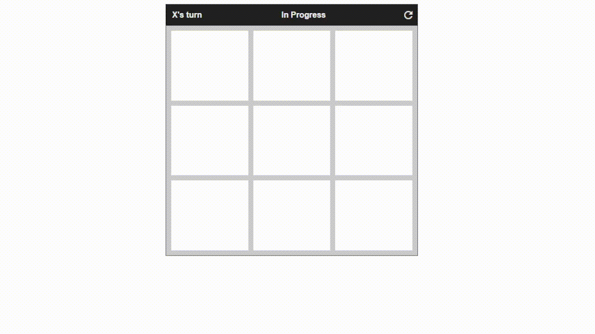

# TicTacToe
Tic tac toe game to pass the time.

## How It's Made:

**Tech used:** HTML, CSS, JavaScript

My learning was focused on making a simple UI and a smooth UX, while improving my logical thinking process.

## Optimizations

When I improve this project I would give it styling for a space-oriented theme so I can integrate the game with Henrys Space Odyssey. I would also implement an AI player.

## Lessons Learned:

I learned that OOP can greatly simplify complicated tasks.

